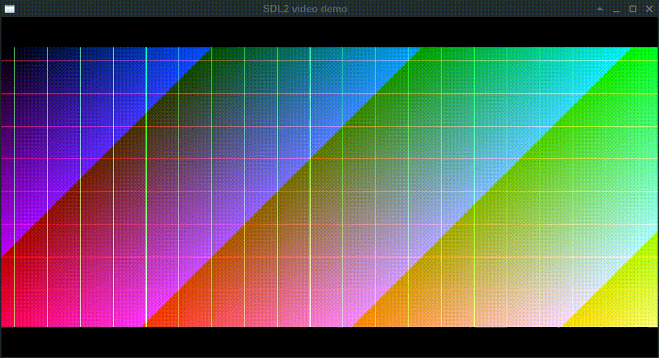

# SDL video demo (for both SDL 2 and SDL 1)

This repository demos fast blitting of a video buffer
to the screen with scaling while respecting aspect-ratio in C99.

There are two versions with ~70% identical code,
one for old SDL 1.x and one for current SDL 2.x.
It has been an explicit goal to allow holding
the two versions' code side by side easily,
e.g. using [Meld](https://meldmerge.org/),
and to be able to compare their performance.

The code is Software Libre licensed under GPL v3 or later.

Here's a quick 256 color recording of what to expect at runtime:



# Requirements

- SDL 2.x
- SDL 1.x
- sdl-gfx for SDL 1.x (not sdl2-gfx)

e.g.:

```console
# sudo apt install --no-install-recommends --yes -V \
    build-essential \
    libsdl1.2-dev \
    libsdl-gfx1.2-dev \
    libsdl2-dev
```


# Compilation

```console
# make CFLAGS='-O2 -pipe' -j
# ./sdl1_video_demo &
# ./sdl2_video_demo &
```


# Hotkeys

- <kbd>f</kbd> or <kbd>F11</kbd> — toggle fullscreen
- <kbd>q</kbd> or <kbd>ESC</kbd> — exit
